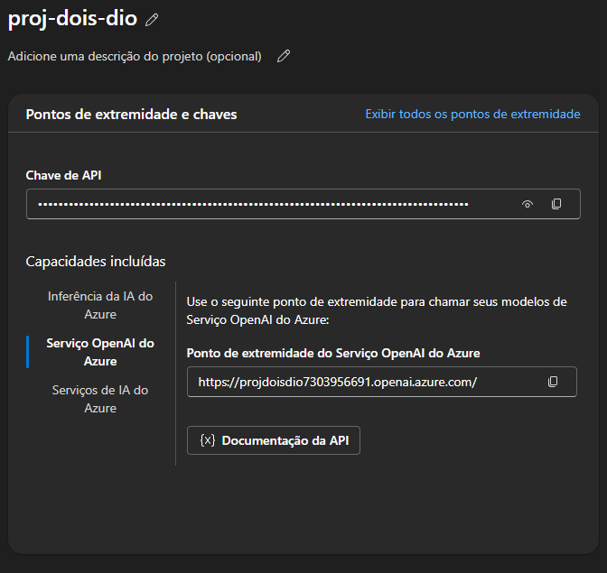

# dio-desafio-dois-dp100
Este projeto tem como objetivo utilizar conceitos relacionados ao Azure ML e testar suas ferramentas disponibilizadas.

## Criando um RG para a atividade

Criando um hub de IA do azure

Criando as chaves e endpoints

Selecionando o modelo

